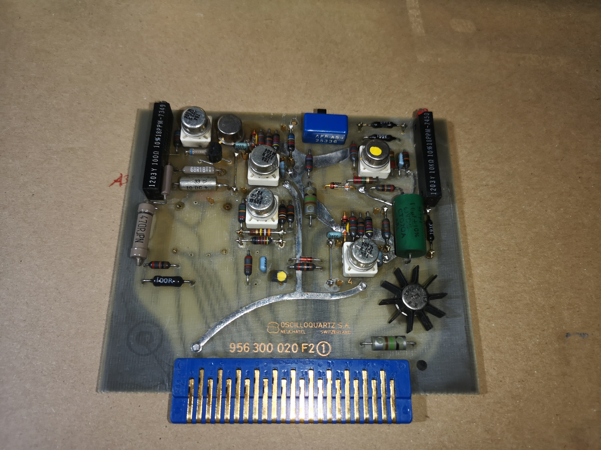
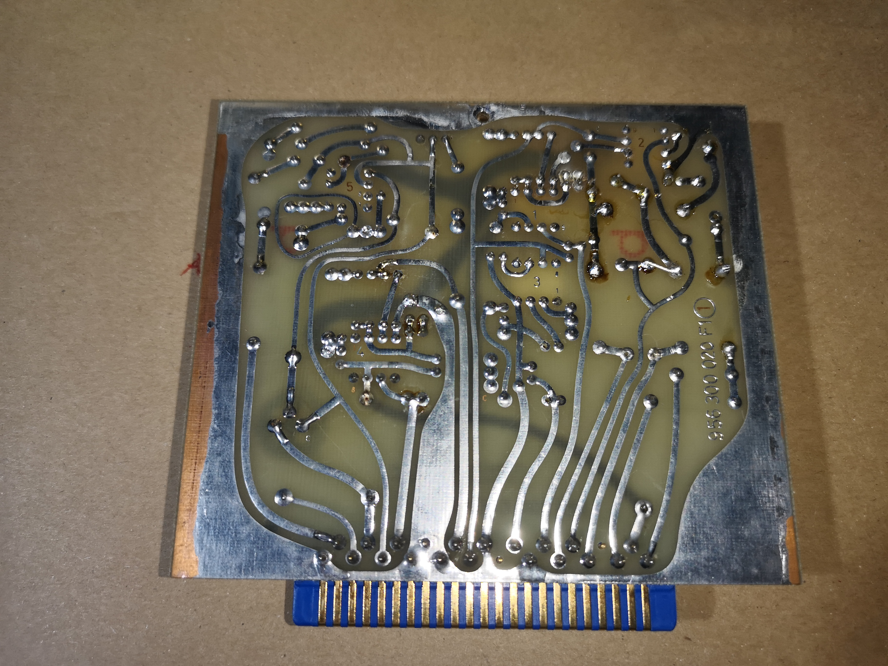

# A3 — Power supply +U1, +U2, C-field, EMVH regulation, Pump alarm logic

## [Function]
Description from block diagram and manual.

## [Board Info]
- Schematic number: 942030010
- PC board number: 956300020

## [Debug]
*(Add debugging logs and results here)*

## [Findings]
*(Add reverse-engineered information here)*

## [Comments]
*(Freeform notes and repair hints)*

## [BOM]
| Ref | Part | Description | Notes |
|-----|------|-------------|-------|

## [Photos]
  

