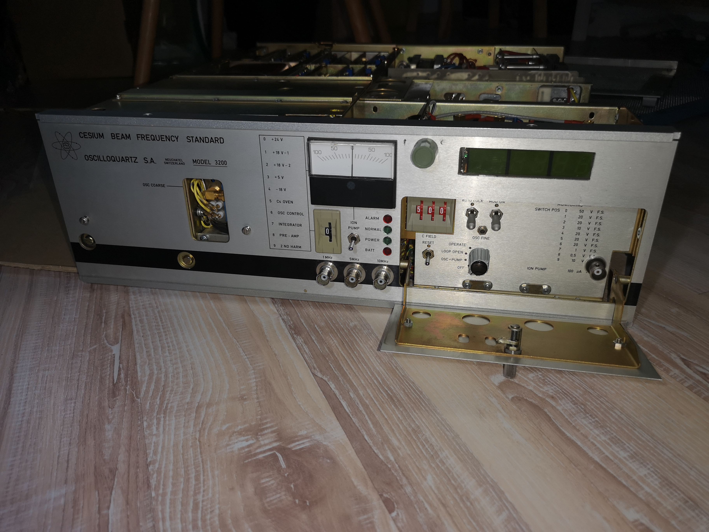
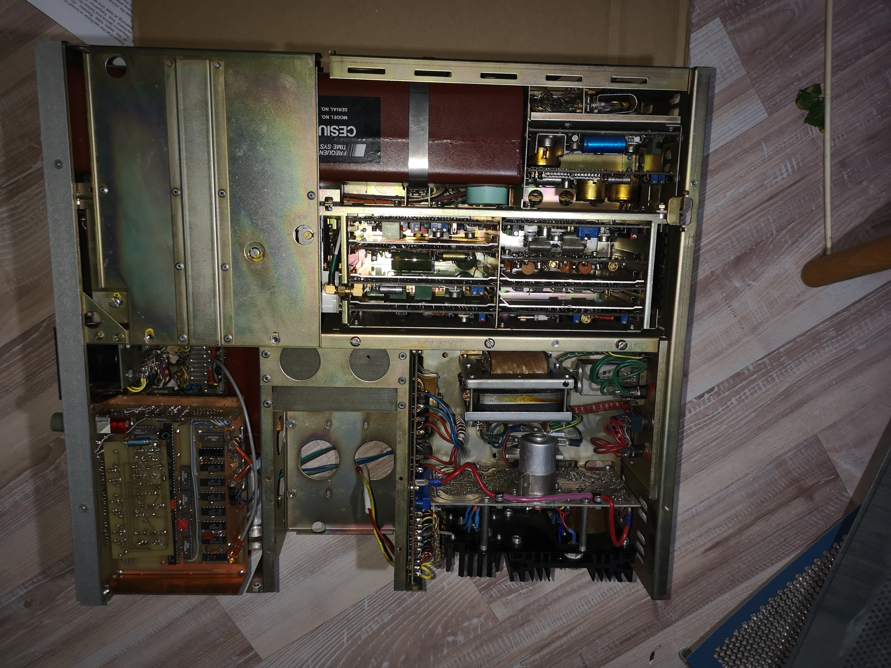
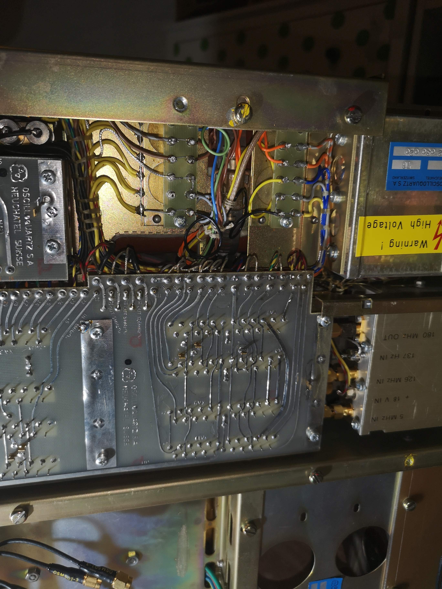
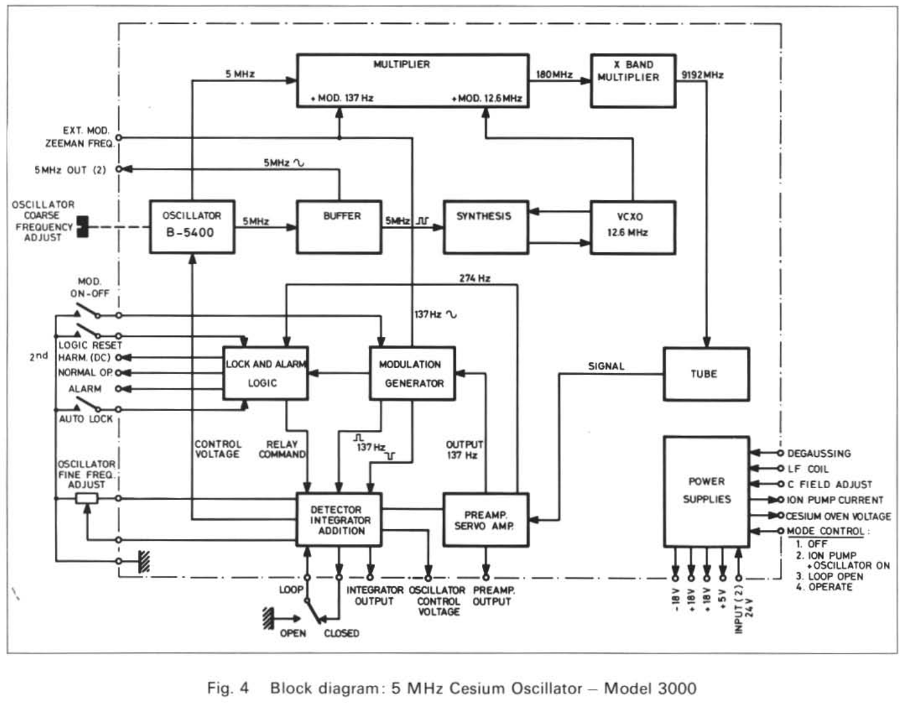

# Oscilloquartz 3200 Repair Overview

## Instrument Photos

## Block Diagram

## 📖 Manual
[View manual](manuals/OSA-3200-manual-part1.pdf)

## Boards

- [A1 — Cesium oven supply](boards/A1_Cesium_oven_supply/A1_Cesium_oven_supply.md)
- [A2 — Power supply +5V, -U ionizer, 26 kHz generator](boards/A2_Power_supply_5V__U_ionizer_26_kHz_generator/A2_Power_supply_5V__U_ionizer_26_kHz_generator.md)
- [A3 — Power supply +U1, +U2, C-field, EMVH regulation, Pump alarm logic](boards/A3_Power_supply_U1__U2_C_field_EMVH_regulation_Pump_alarm_logic/A3_Power_supply_U1__U2_C_field_EMVH_regulation_Pump_alarm_logic.md)
- [A4 — Buffer amplifier 5 MHz](boards/A4_Buffer_amplifier_5_MHz/A4_Buffer_amplifier_5_MHz.md)
- [A5 — Synthesizer](boards/A5_Synthesizer/A5_Synthesizer.md)
- [A6 — VCXO 12.631770 MHz](boards/A6_VCXO_12_631770_MHz/A6_VCXO_12_631770_MHz.md)
- [A7 — Modulation generator, Quadrature detector](boards/A7_Modulation_generator_Quadrature_detector/A7_Modulation_generator_Quadrature_detector.md)
- [A8 — Synchronous detector, Integrator, Summing](boards/A8_Synchronous_detector_Integrator_Summing/A8_Synchronous_detector_Integrator_Summing.md)
- [A9 — Pre-amplifier, Servo amplifier](boards/A9_Pre_amplifier_Servo_amplifier/A9_Pre_amplifier_Servo_amplifier.md)
- [A10 — 2nd harmonic detector, Alarm logic](boards/A10_2nd_harmonic_detector_Alarm_logic/A10_2nd_harmonic_detector_Alarm_logic.md)
