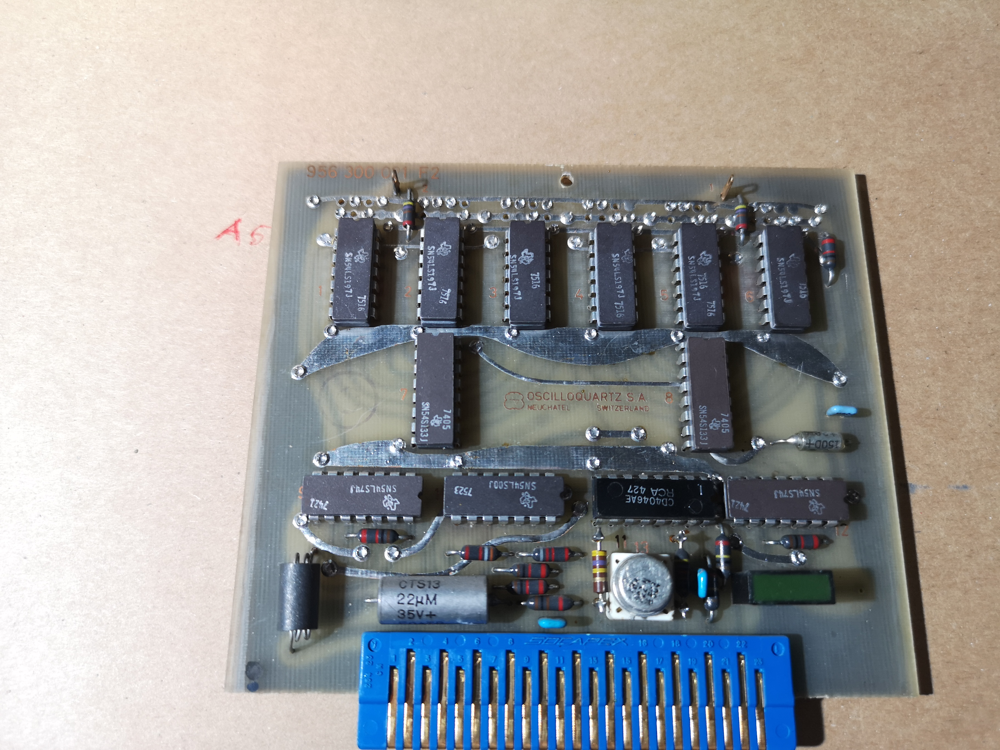

# A5 — Synthesizer

## [Function]
Generates the 12.6 MHz and 137 Hz modulation signals that are summed and processed to synthesize a 180 MHz signal. This output is modulated for the Ramsey excitation of the Cesium atoms.

## [Board Info]
- **Schematic number**: 942030011  
- **PC board number**: 956300021

## [Photos]
  

More Images

  
  

## [Debug]
- All ICs are military-grade SN54xx and SN54Sxx TTL series.
- Board silkscreen: `OSCILLOQUARTZ S.A. NEUCHATEL SWITZERLAND`
- Test points: TP1–TP3 observed near logic sections, likely for frequency chain debugging.
- One adjustable potentiometer, possibly for fine frequency or duty cycle calibration.

## [Findings]
- U1–U6 form a 6-stage counter chain using SN54LS197 presettable binary/decade counters.
- U7–U8 are SN54S133 13-input NAND gates — likely used to detect specific states or provide resets.
- U9 is a SN54LS74 dual D flip-flop, often used for clock division or synchronization.
- U10 is a SN54LS00 quad NAND gate — commonly used in glue logic or oscillator construction.
- U11 is a CD4046AE phase-locked loop (PLL) IC — used to lock to or generate modulation frequencies.
- U12 is a 22 µF electrolytic capacitor (CTS13 can type), likely decoupling or PLL loop filter.
- U13 is unreadable; likely analog (possibly an op-amp or buffer).

## [Comments]
- The layout is typical for a 1970s/80s frequency synthesizer with mixed logic families.
- Military-grade ICs indicate this was likely built for long-term, stable operation.
- Minimal corrosion observed; solder joints appear robust.
- Good candidate for ESR test on large electrolytic caps.

## [BOM]
| Ref  | Part Number        | Description                                           | Notes |
|------|--------------------|-------------------------------------------------------|-------|
| U1   | TI SN54LS197J      | Presettable decade/binary counter                     | [Datasheet (PDF)](../../manuals/SN54196.PDF) |
| U2   | TI SN54LS197J      | Presettable decade/binary counter                     | ^     |
| U3   | TI SN54LS197J      | Presettable decade/binary counter                     | ^     |
| U4   | TI SN54LS197J      | Presettable decade/binary counter                     | ^     |
| U5   | TI SN54LS197J      | Presettable decade/binary counter                     | ^     |
| U6   | TI SN54LS197J      | Presettable decade/binary counter                     | ^     |
| U7   | TI SN54S133J       | 13-input NAND gate                                    | [Datasheet (PDF)](../../manuals/SN54S133.PDF) |
| U8   | TI SN54S133J       | 13-input NAND gate                                    | ^     |
| U9   | TI SN54LS74J       | Dual D-type flip-flop with set/reset                  | [Datasheet (PDF)](../../manuals/sn54ls54.pdf) |
| U10  | TI SN54LS00J       | Quad 2-input NAND gate                                | [Datasheet (PDF)](../../manuals/SN54LS00) |
| U12  | TI SN54LS74J       | Dual D-type flip-flop with set/reset                  | [Datasheet (PDF)](../../manuals/sn54ls54.pdf) |
| U11  | RCA CD4046AE       | Phase-Locked Loop with VCO and comparator             | [Datasheet (PDF)](../../manuals/RCA-CD4046AE.pdf) |
| U13  | [Unreadable]       | Possibly op-amp, comparator, or buffer                | TBD (needs probing) |

