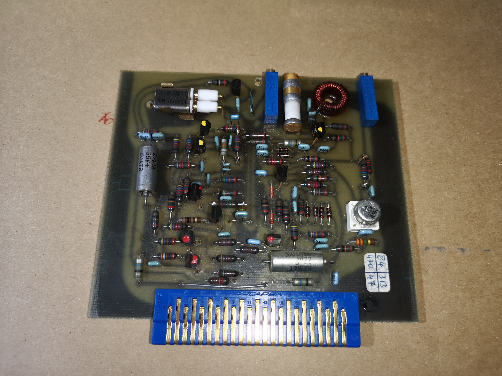
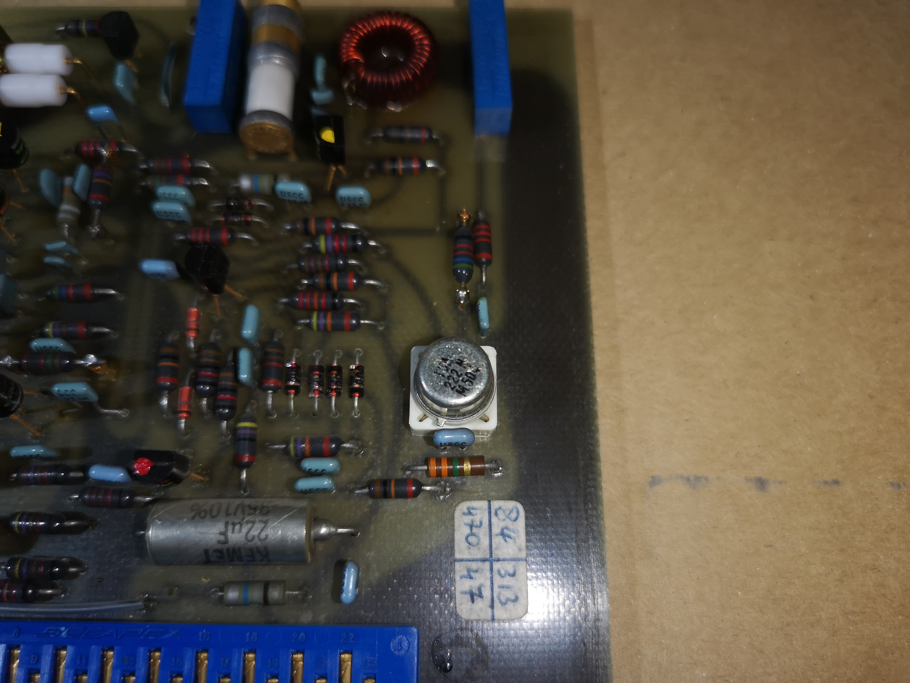
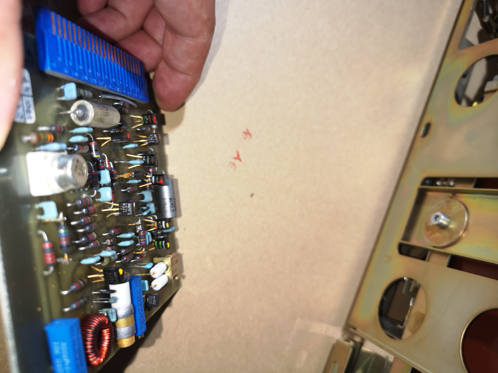
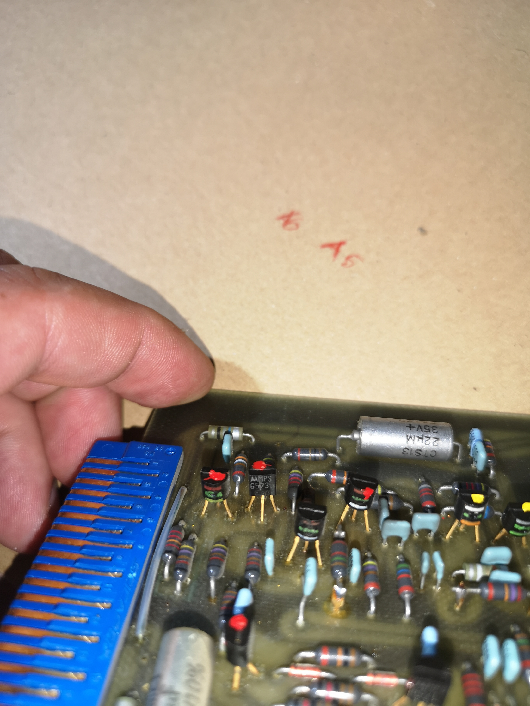
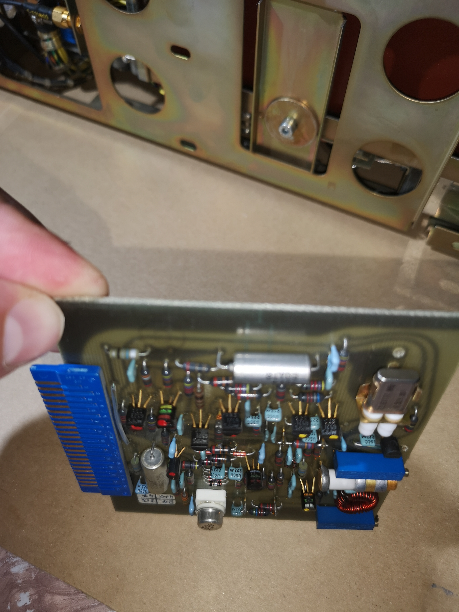

# A6 — VCXO 12.631770 MHz

## [Function]
Description from block diagram and manual.

## [Board Info]
- Schematic number: 942030017
- PC board number: 956300024

## [Photos]

More Images

## [Debug]

## [Findings]

## [Comments]

## [BOM]
| Ref | Part | Description | Notes |
|-----|------|-------------|-------|
