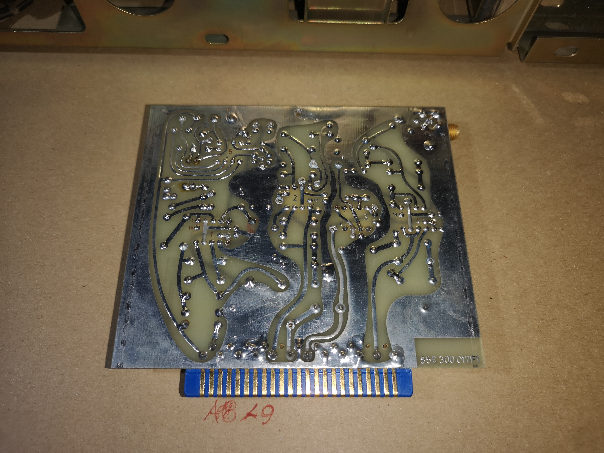
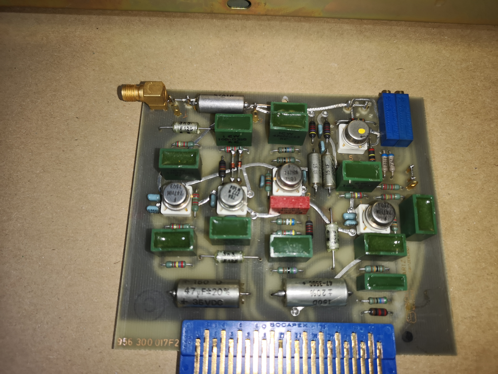
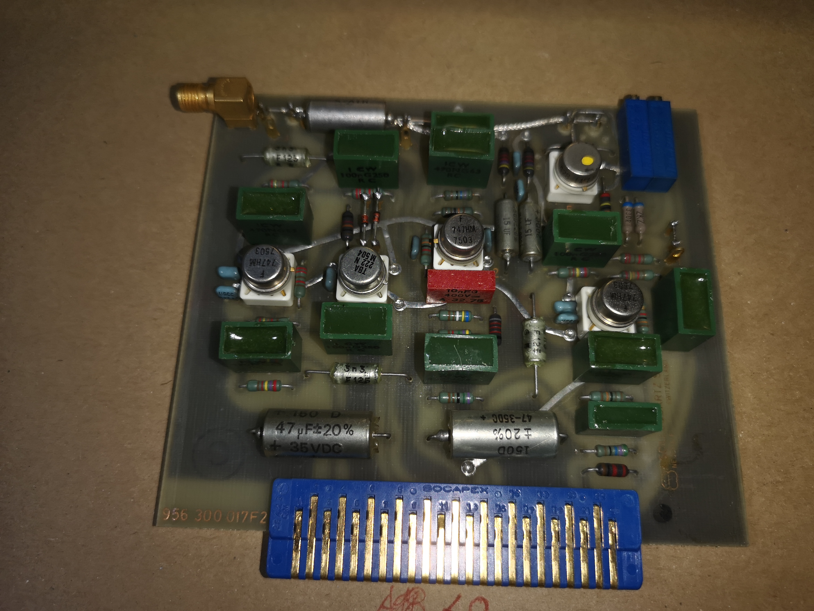
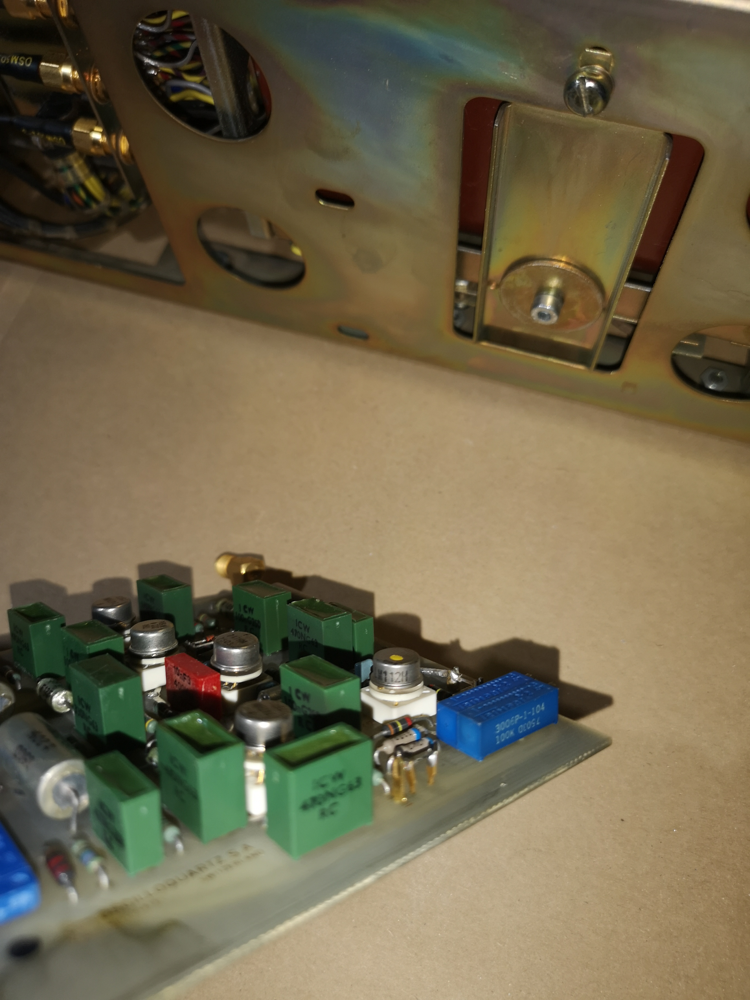

# A9 — Pre-amplifier, Servo amplifier

## [Function]
Description from block diagram and manual.

## [Board Info]
- Schematic number: 942030007
- PC board number: 956300017

## [Photos]

More Images

## [Debug]

## [Findings]

## [Comments]

## [BOM]
| Ref | Part | Description | Notes |
|-----|------|-------------|-------|
